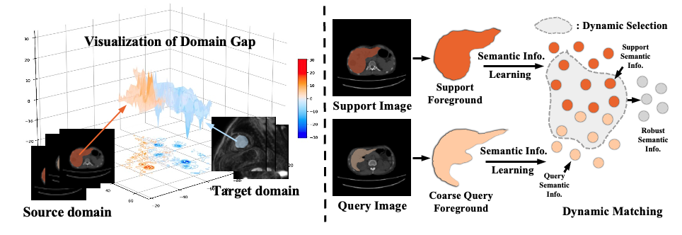

### Cross-domain Few-shot Medical Image Segmentation via Dynamic Semantic Matching

#### Brief Introduction
Cross-domain few-shot medical image segmentation (CDFSMIS) presents the fundamental challenge of segmenting novel anatomical or tissue structures on unfamiliar medical imaging domains with limited annotated data. In this paper, we conduct an in-depth investigation of CDFSMIS and identify two critical observations: (a) the conventional matching mechanisms from existing few-shot models are particularly vulnerable to discrepancies in local characteristics between different domains and (b) the semantic representations learned from source domains often lack robustness when generalizing to unfamiliar target domains. Motivated by these insights, we propose a novel Dynamic Semantic Matching (DSM) framework that addresses these challenges through a three-component approach. First, we design a support-query feature re-weighting (SFR) mechanism that leverages multilevel hidden features to suppress domain-specific contents. Second, we introduce a dynamic semantic information selection (DSIS) strategy that adaptively identifies and combines domain-robust channels to construct generalizable representations. Third, we develop a dual-perspective semantic center calculation method to address the inherent texture imbalance in medical images. 

